Tutorial 0: Setting Up virtual environment
======================================================

This tutorial will help you become familiar with Virtual Computing and will also serve as an introduction to setting up a cluster. This tutorial will start with installing and setting up VirtualBox, an environment you can use to setup and initiate virtual machines (VM).

a Virtual machine is a type of simulated machine running on top of your current laptop or desktop environment. It "emulates" what a real machine and its OS would behave like.

Here you will need to make a decision on choice of Linux distribution that you will use, remember that your VM has very limited resources as it will share the host machine's resources. 

Once your team has successfully setup VirtualBox and loaded your preferred OS, we can easily add additional machines to build a makeshift cluster.

# Table of Contents

<!-- markdown-toc start - Don't edit this section. Run M-x markdown-toc-refresh-toc -->

1. [Checklist](#checklist)
1. [Install VirtualBox](#install-virtualbox)
    1. [Download VirtualBox](#download-virtualbox)
1. [VirtualBox](#virtualbox)
    1. [Network](#network)
    1. [Create new VM](#create-new-vm)
    1. [Operating System](#operating-system)
    1. [Download OS](#download-prefered-os)
    1. [Mount and Install](#mount-and-install)
1. [Setup Cluster](#setup-cluster)

# Checklist

<u>Use the following checklist to keep track of your team's progress and to ensure that all members in your understand these concepts.</u>

- [ ] Understand virtual computing, virtualisation and remote connections:
  - [ ] Understand and be able to explain virtualisation and virtual machines
  - [ ] Understand the difference between a NAT, bridged, internal and host only adaptors.
- [ ] Learn how install an Operating System (OS):
  - [ ] Learn about different Linux Distributions and Flavors
- [ ] Learn how setup a cluster on VirtualBox:
  - [ ] Learn how to link up different machines

# Install VirtualBox

## Download VirtualBox

Head to your favourite search engine and search "VirtualBox download". Download virtualBox from virtualbox.org the one from Oracle.

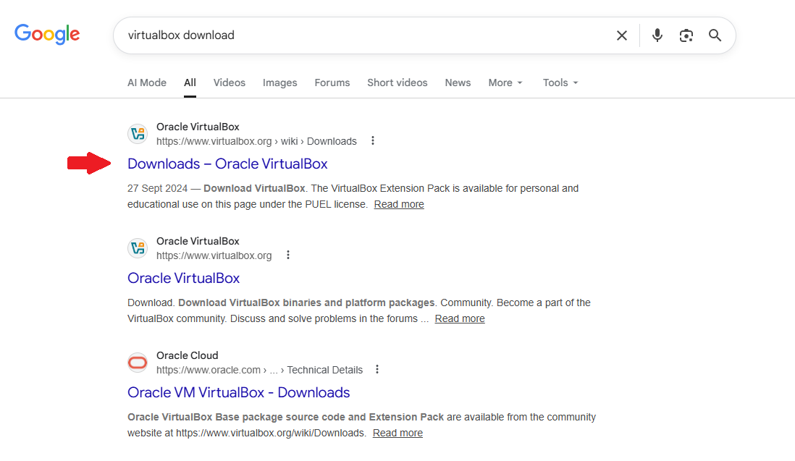

Pick the correct build matching your host OS.

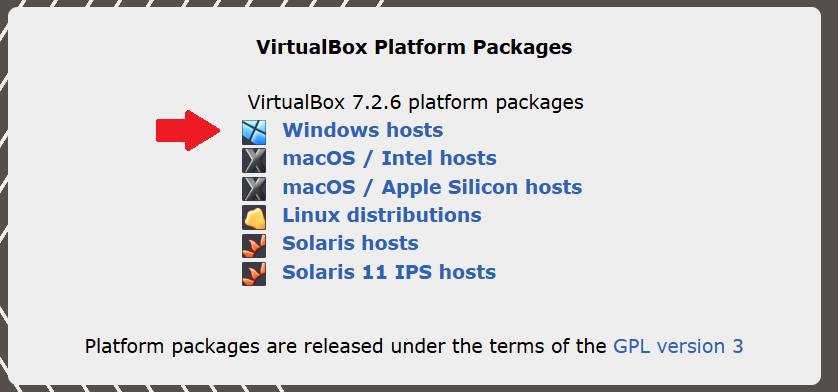

The installation is straightforward, just click next, yes and install when asked.

# VirtualBox

Import components of VirtualBox to take note of have been listed below.

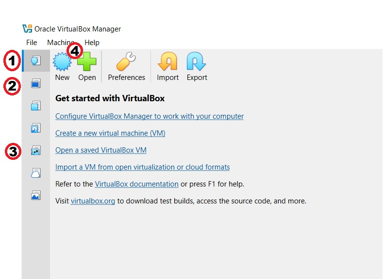

1. Home      - Takes you back to the start screen
2. Machines  - Display list of all virtual machines
3. Network   - Display all global network related settings
4. New       - Create new VM

## Network

There are 4 basic network configurations. Try and understand the difference between the 4.

1. NAT - Network Address Translation (NAT) is a technique used in networking to map an entire private network (LAN) to a single, public IP address for internet communication.

 - Think of this as your gateway to the internet.
 - Using this adaptor type will supply internet *only* 

2. Bridged adaptor - Piggy back on the back of your host machines network card.

 - Using this adaptor will *connect* you to the host machine network.
 - You will have access to all device on the host machine network including routers or servers on that network.
 - !!! Be careful with this type of adaptor
    -   For example, setting your VM as a DHCP server and the VM will broadcast in your network.

3. Internal network - create an named internal network that we can share between VM's

 - Think of this as a switch where you can plug VM's into.

4. Host-only Adaptor - Very simular to internal network, except you can use VirtualBox as a DHCP.

 - Simular to Internal network but more customizable

Below is an example of the network adaptors you can attach to a virtual machine.

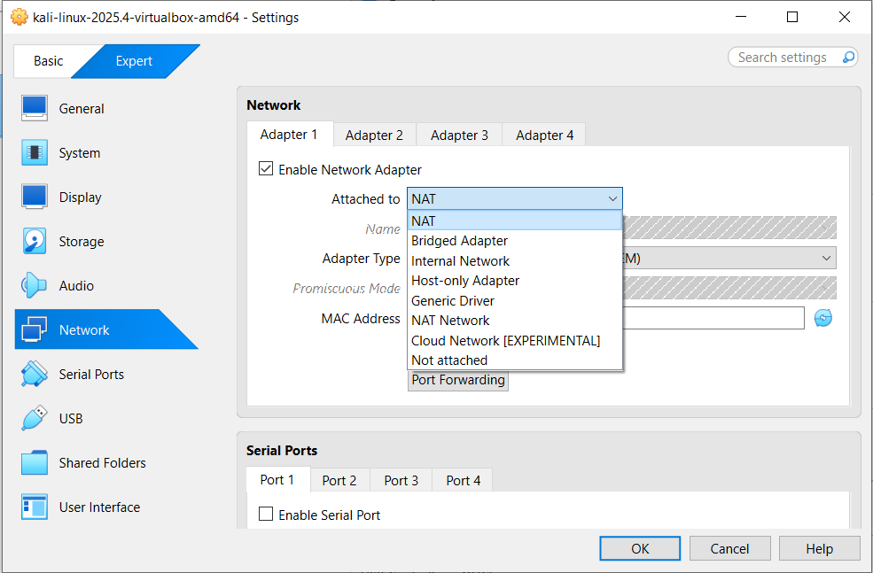

In the network tab you can customize the Host and NAT adaptor more.

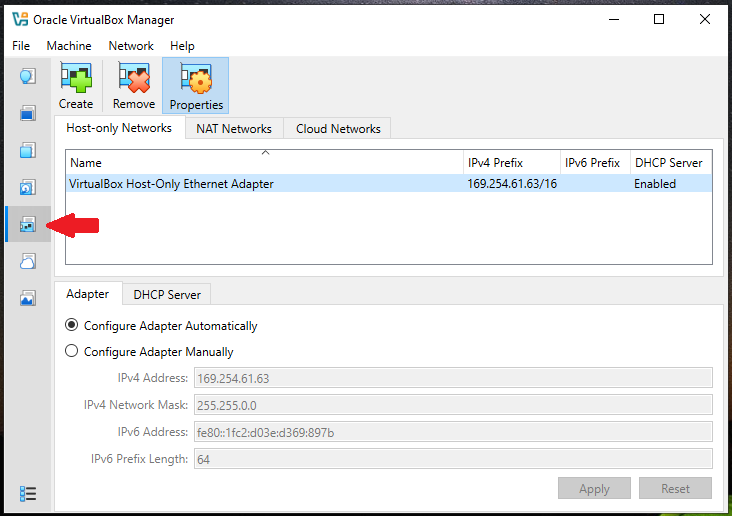

## Create new VM

Head to the HOME screen and press NEW, to create a new VM.

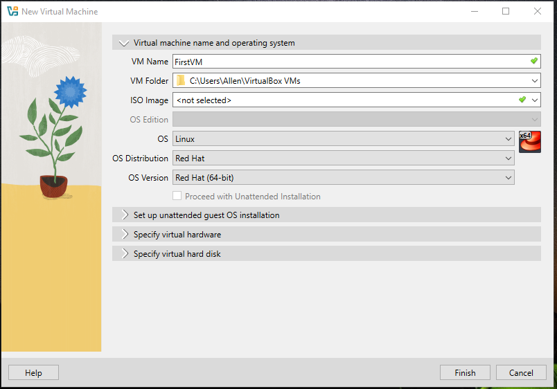

Type a name and select a distro. Ignore ISO and unattended OS installion for now.

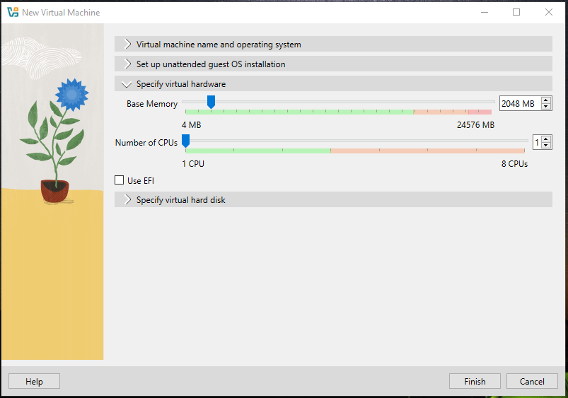

Select appropriate specs for your headnode based on your host machine.

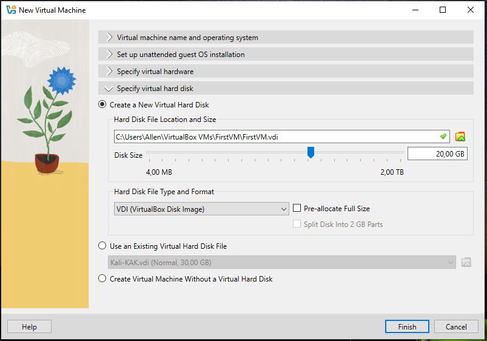

You can leave storage on the default settings as it is always possible to edit this again at a later stage.

## Operating System

You can head to the home screen and start your new VM. It will boot and wait for an ISO.

## Download prefered OS

You can head to [this site](https://www.linux.org/pages/download/) to see some distro options.

Select a distro you feel comfortable with or select the trusted Ubuntu or RockyOS.

## Mount and Install

Mount your downloaded ISO and complete the linux distro installation.

# Setup cluster

You are now ready to create additional VM's and setup your cluster. Below is a network plan. 

!NOTE you can only change the network settings if the machines are **powered off**

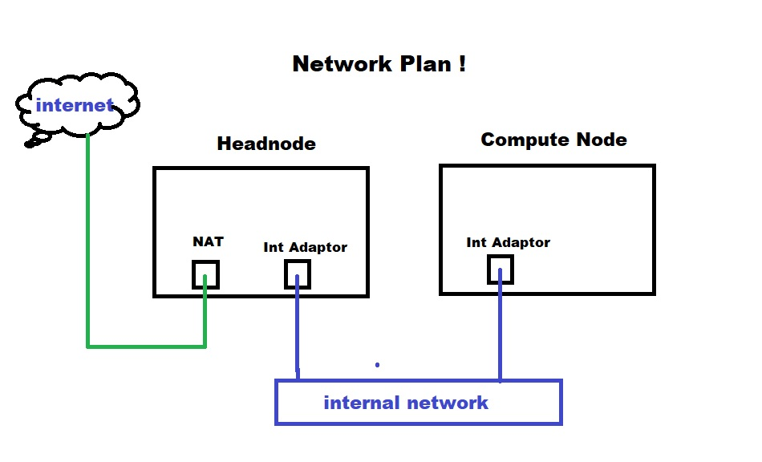

Our headnode will have 2 network adaptors. NAT for internet and internal for the internal network.

Bring up the headnode's settings by selecting the MACHINES tab, select the VM and select settings.

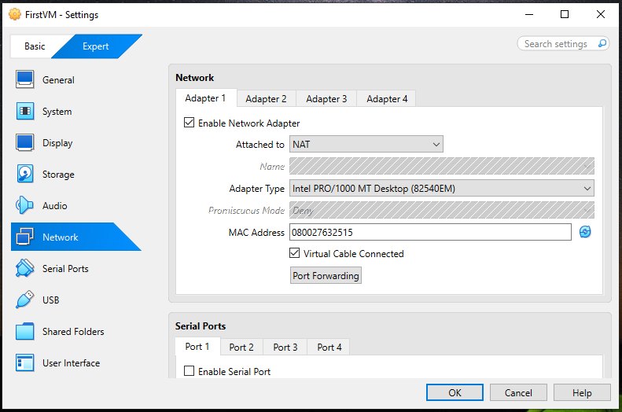

Head to the VM's network setting and add a second adaptor.

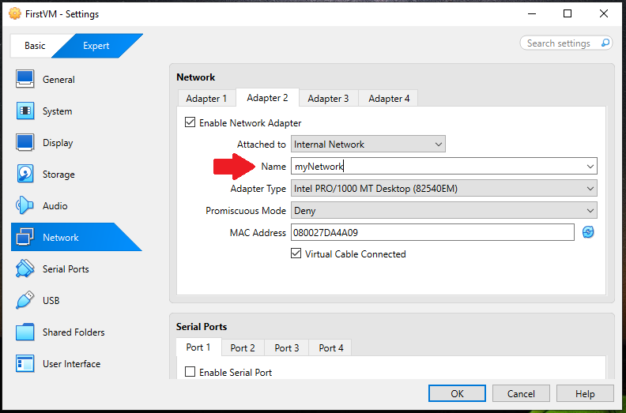

! Note the network name, remember to use the exact same name for the compute node to place them both on the "*same* (switch) *network*"

Now configure the compute node. Remember it only needs one adaptor.

If you have configured the headnode correctly the network will appear in the list.

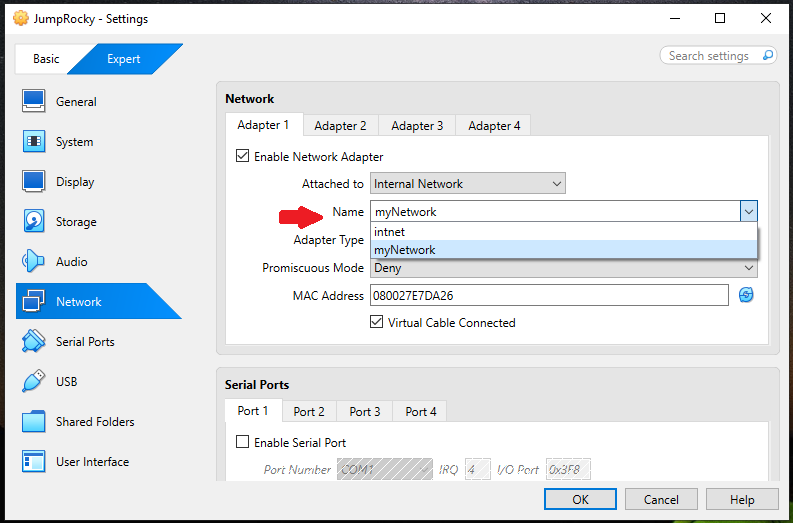

Once the network between the machines has been setup. You can configure the IP's on each VM and your cluster will be connected.